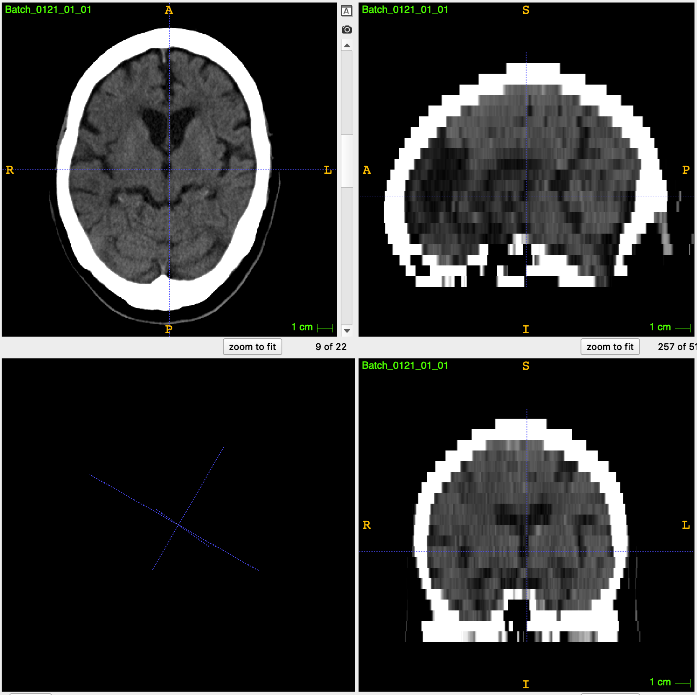
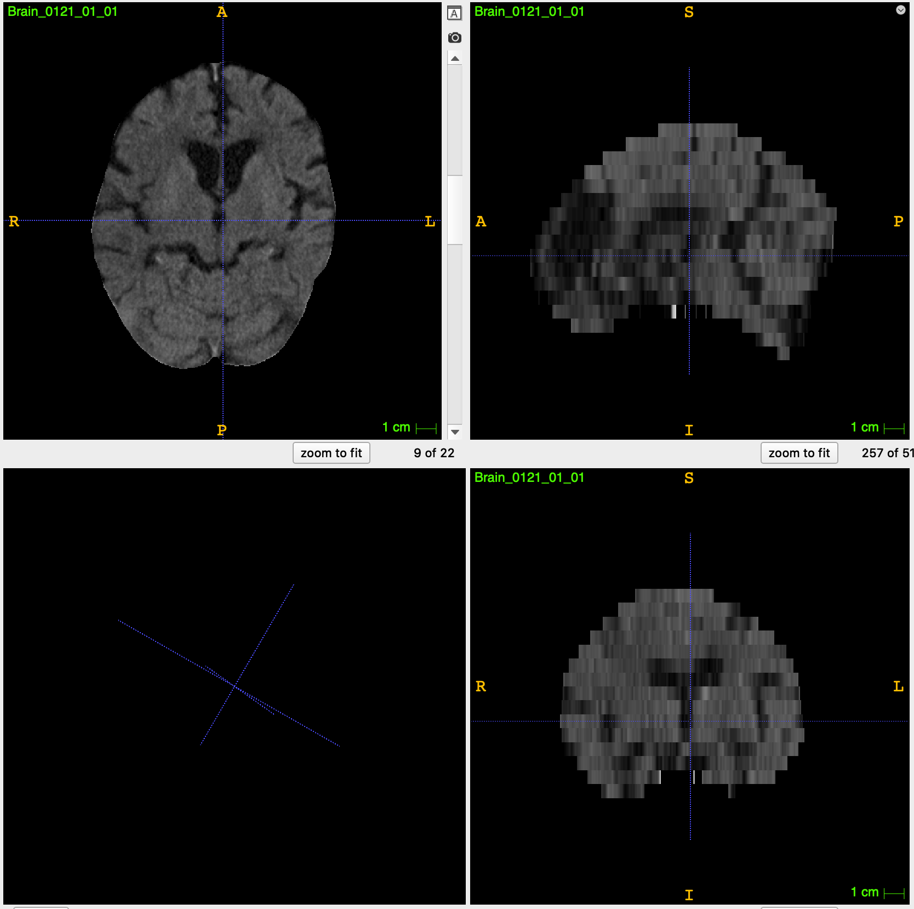
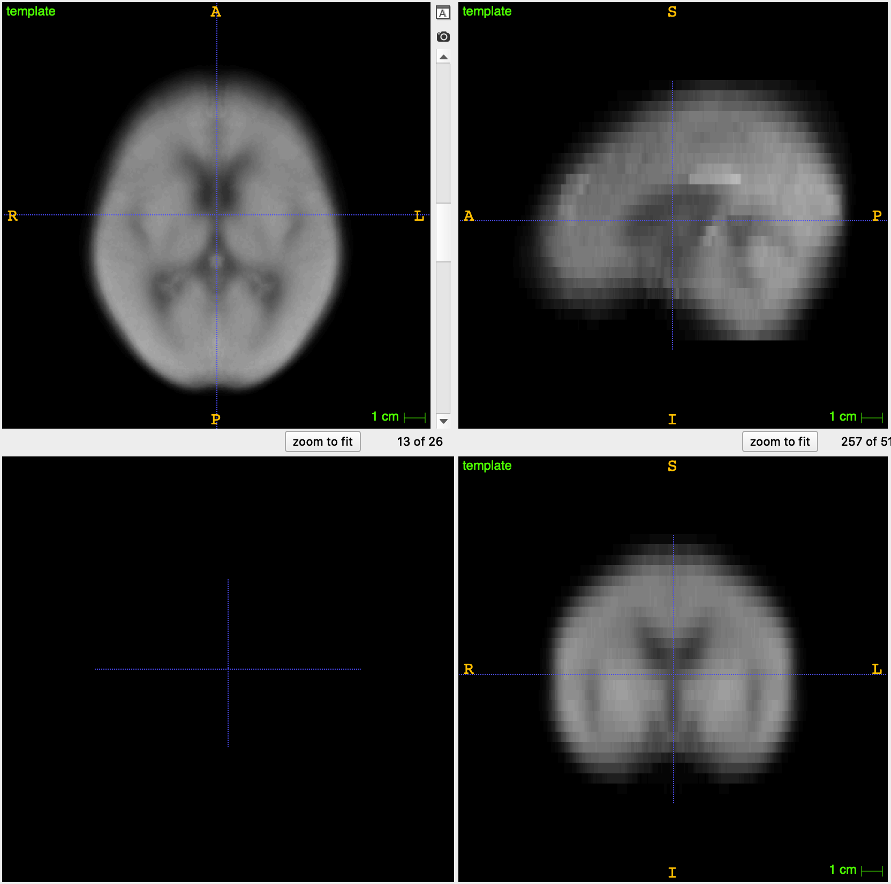
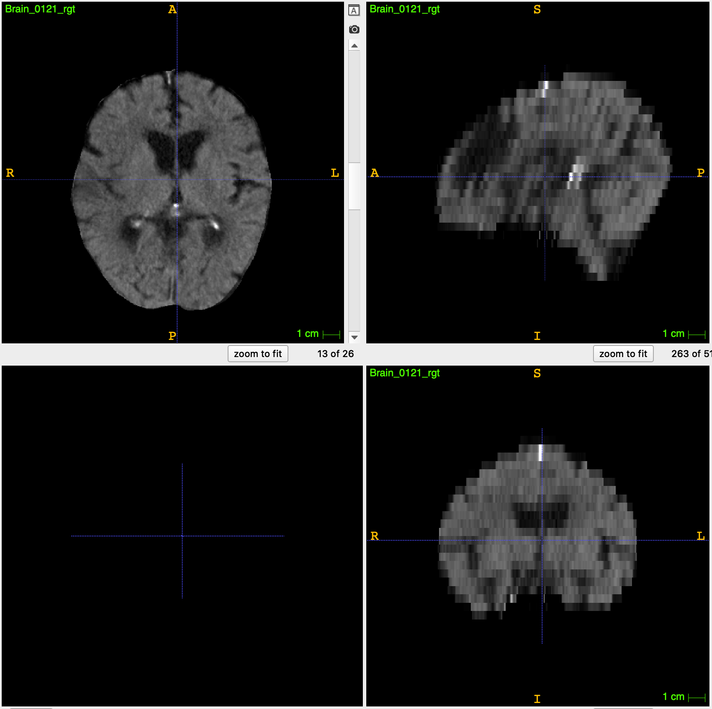

# Automated segmentation of the hyperdense MCA sign of acute ischemic stroke on non-contrast CT images

The Project for automated segmentation of the hyperdense MCA sign on non-contrast CT images. 
In order to geometrically align all CT brains, we launched a data-preprocessing procedure.
- The data pre-processing step was mainly conducted with [FSL](https://fsl.fmrib.ox.ac.uk/fsl/fslwiki/)

### Example

#### Raw Brain

#### Skull-stripped Brain

#### Brain template 

#### Registered_Brain Brain

Models and weights will be shared later upon the publication of our research.

- The data pre-processing step was mainly conducted with [FSL](https://fsl.fmrib.ox.ac.uk/fsl/fslwiki/)
